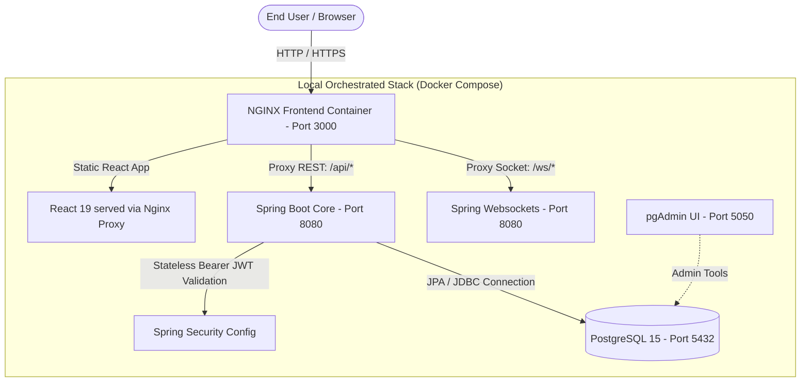

# 🌾 AgriExchange: High-Performance Real-Time Agricultural Commodity Trading Platform

> **AgriExchange Core v2.4 (Enterprise Edition)**
> A professional, secure, containerized commodity trading and real-time auction platform designed to bridge verified agricultural growers directly with bulk institutional buyers. Wired with stateless cryptography, live WebSocket transactional streams, and executive-level auditing controls.

---

## 🎨 Enterprise Product Highlights & Features

### 1. 🛡️ Self-Contained Stateless JWT Cryptography
To enforce enterprise security, the platform operates a stateless, high-performance authorization interceptor built with custom Java cryptography:
*   **Cryptographic Signatures:** Token signatures are hashed with high-entropy **HMAC-SHA256** Base64 URL algorithms.
*   **Request Interception:** Stateless filters validate Bearer headers and establish context for protected resource routes.
*   **Security Precaution:** Login checks differentiate errors exactly. If a user enters a registered email but an incorrect password, it secures responses with a precise password-incorrect prompt rather than disclosing account existence (preventing email enumeration attacks).

### 2. 🌐 Native HTML5 Real-Time WebSocket Streams
*   **Sub-Second Outbid Pushes:** Integrates native browser HTML5 WebSockets with Spring WebSocket handlers to broadcast transactional bid updates across concurrent active screens instantly.
*   **Instant UI Syncing:** Outbid notifications slide onto screen layers using glassmorphic overlay toasts, refreshing listing states, tables, and ledgers in real-time without manual page refreshes.

### 3. ⏳ Live countdowns, lockouts, & Time-Based Sorting
*   **Time-Based Sorting:** active crop auctions are automatically sorted at the database load level by **time remaining (ascending)**, guaranteeing listings closing soonest are prioritized at the top of the feed.
*   **Visual Muting:** Expired listings are grayscaled, faded (opacity `0.65`), shifted to the absolute bottom of the catalog, and their bidding desks, numeric forms, and action triggers are automatically locked out.

### 📊 4. Live scrolling SVG transaction Flow Monitor
*   **Dynamic SVG Wave:** The administrator console displays a state-driven, dynamic SVG curve representing transaction load.
*   **Scrolling ticker:** An active background routine shifts the coordinate values leftwards smoothly every 3 seconds, representing live network throughput.

### 📜 5. Legally Compliant Auction Audit Reports
*   **Tab Integration:** Admins can access a dedicated auditing panel to select any active or completed harvest.
*   **Official Auditing Ledger:** Instantly compiles an official commercial audit report calculating:
    *   Crop properties, grower details, and volumes.
    *   **Projected/Final Gross Value** (`highestBid * quantity`).
    *   Chronological **Bid Ledger Timeline** tracking bidder initials avatar bubbles, names, bid value, and timestamps down to the exact second.

---

## 🏗️ Architecture & Technology Stack



*   **Backend:** Java 17 + Spring Boot 3.2.5 + Maven (Spring Web, Security, JPA, Websocket)
*   **Database:** PostgreSQL 15 (Alpine)
*   **Frontend:** React 19 + Vite (Vanilla CSS modern dark-slate design system, glassmorphism)
*   **Containerization & Server:** Docker (multi-stage JRE and Nginx proxy configs) & Docker Compose
*   **CI/CD Pipeline:** GitHub Actions (Validates compilation, runs tests, and builds docker layers)

---

## 📁 Repository Structure

```text
agri-platform/
├── .github/workflows/
│   └── ci.yml             # Cloud CI validation (Java compile & Vite assets build)
├── backend/                   # Spring Boot Enterprise API
│   ├── Dockerfile             # Multi-stage production Java JRE container
│   ├── pom.xml                # Core maven dependencies (Web, Security, JPA, Postgres)
│   └── src/main/java/com/agri/platform/
│       ├── config/            # JWT TokenService, SecurityConfig, Websockets, Seeder
│       ├── controller/        # Auth REST Endpoints, Bids, and Moderator controls
│       ├── entity/            # JPA Data Entities (User, Product, Bid, Order)
│       └── service/           # Security and Transaction business logic
├── frontend/                  # React Frontend client
│   ├── src/
│   │   ├── App.jsx            # Main app router, role view desks, and overlays
│   │   ├── index.css          # Vanilla corporate HSL design system and muting rules
│   │   └── main.jsx           # Client initiator
│   ├── Dockerfile             # SPA Nginx server build container
│   ├── nginx.conf             # Ingress proxy path routes
│   └── package.json           # React dependencies
└── docker-compose.yml         # Local microservice cluster launcher
```

---

## 🚀 Rebuilding & Running the Stack Locally

### Prerequisites
Make sure you have [Docker Desktop](https://www.docker.com/products/docker-desktop/) installed on your machine.

### Run in Detached Mode (Production-ready)
To start your entire secure microservice stack in the background:
```bash
docker compose up -d --build
```

### Access Ports
*   **Platform Portal (NGINX SPA):** [http://localhost:3000](http://localhost:3000)
*   **Spring Boot core REST API:** [http://localhost:8080](http://localhost:8080)
*   **pgAdmin DB Console:** [http://localhost:5050](http://localhost:5050)
    *   *pgAdmin Credentials:* `admin@agriplatform.com` / `adminpassword`

---

## 🎭 Role-Based Enterprise Workspaces

The platform automates account provisioning via database seeding on startup. During demonstrations, you can toggle between three secure structural workspaces to show complete logic isolation:

*   **Executive Administration Desk:** Tracks active listing margins, automates member registers, monitors transaction flow rates, and reviews official chronological audit logs.
*   **Grower Harvesting Desk:** Publishes organic crops, customizes regions, triggers categories, and governs live grower countdown auctions.
*   **Wholesale Bidding Desk:** Searches state-level products, calculates minimum increment bounds, and syncs real-time WebSocket outbid alerts.

---

## 🔌 Core Enterprise API Endpoints

All endpoints except authentication are protected and require a Bearer token: `Authorization: Bearer <JWT_TOKEN>`

### Authentication Server
*   `POST /api/auth/register` - Registers a verified Grower or institutional Buyer.
*   `POST /api/auth/login` - Validates credentials and returns JWT bearer tokens.

### Commodity Catalog
*   `POST /api/products` - Growers publish a crop harvest with custom durations and base rates.
*   `GET /api/products` - Returns active listings sorted by soonest closing time, and ended listings at the bottom.
*   `DELETE /api/products/{id}` - Administrators moderate and remove crop listings.

### Transactional Bidding Engine
*   `POST /api/bids` - Places a validated secure bid (requires exceeding current highest bid by at least ₹1.00).
*   `GET /api/bids/product/{productId}` - Retrieves chronological bid ledgers for a product (highest first).

---

## 🛡️ High-Performance CI/CD Validation
On every commit to `main`, the `.github/workflows/ci.yml` pipeline triggers in parallel:
1.  **JDK Setup & Build:** Loads Java 17 and compiles the Spring Boot source files.
2.  **Vite Assembly:** Compiles React frontend files for production bundle verification.
3.  **Dockerization Audits:** Validates both multi-stage Dockerfiles (`frontend/Dockerfile` & `backend/Dockerfile`) in a cloud runner to ensure 100% containerization integrity.
